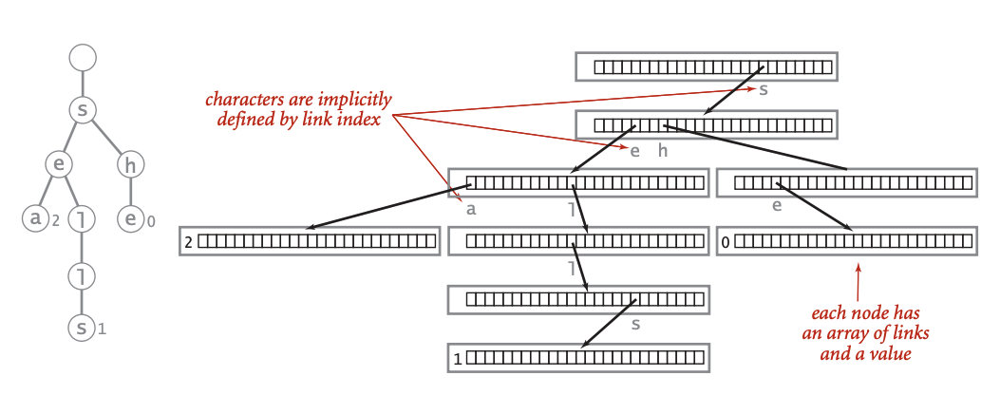
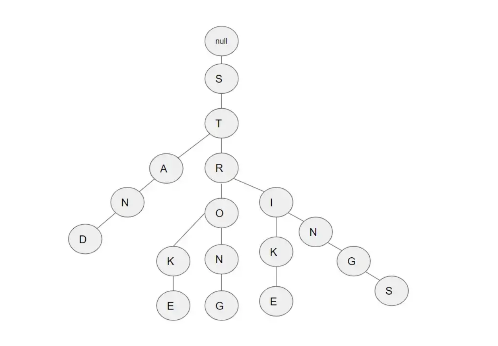

# The Trie Data Structure
Presented to you by: Angel Pichardo De La Cruz, Jacob Duhaime, Nicholas Faciano and Harry Grenier.
 
<h1>What is 'Trie'?</h1>

 Trie (pronounced <b>“Try”</b>, comes from the word <b>“retrieval”</b>) is a k-ary search tree data structure that is used for sophisticated types of data, such as strings. In this data structure, the links between the nodes are defined by individual characters from a string in which every child node is associated with its parent node. With Trie, you can do operations such as insertion, deletion and searching. A simplest way to explain this data structure is as an array of pointers to other nodes. Please look at the example below which depicts this: 

<i>Credits to Wikipedia article "Trie"</i>

 

<h2>More examples about Trie</h2>

Hypothetically, let's state that we are using trie for a spell checker in which we are trying to find the correct spelling of a word. A user would input the word “Codign” (for coding). The data structure will spawn in the first node which will be for character “c”. Then it would make another node with the letter “o” while still being pointed at by the previous node. Then, another node is generated with the letter “d”, then letter “i”. By this point of having the characters “codi”, it can do a search for all possible words that start with those 4 characters like codify, coding, codirect…etc.from a database provided to it. Essentially, it would pull out all of the words in the dictionary that can be a match for the word that we are looking for. Please look example below which shows how Trie looks for the possible matches:

<i>Credits to "Understanding Trie Data Structure"</i>

<h2>Anything interesting about this data structure?</h2>

Absolutely! A fun fact about Trie is that time is really constant when it comes to this data structure. The number of other items in the data structure does not impact the steps it takes in order to find a match. The only thing that impacts this data structure is the length of the string itself, for example: if we are looking for the word “cat” in a library of 10 words vs in a library of 10,000 words, the time it would take to find the word Cat is the same.

<h2>Time Complexity</h2>

#New Section
<h1>Our Project: Spell Checker</h1>

<h2>How To download and run our project</h2>

<h4>For More information about Trie feel free to download our Trie report located under the "Files" fodler in our GitHub main repository</h4>
